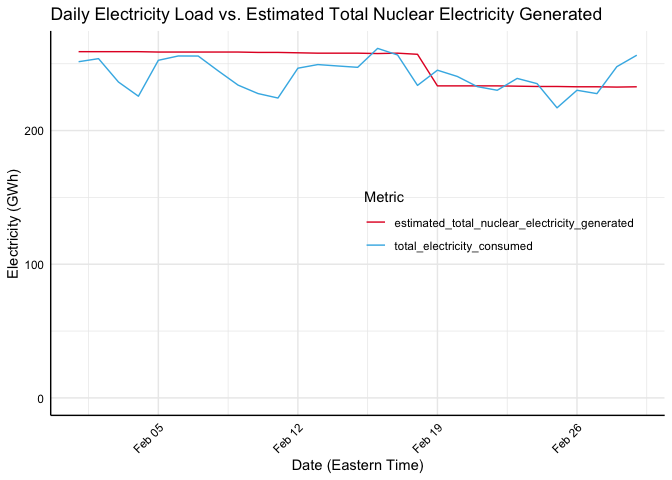

This is an [R Markdown](http://rmarkdown.rstudio.com) Notebook. When you
execute code within the notebook, the results appear beneath the code.

Try executing this chunk by clicking the *Run* button within the chunk
or by placing your cursor inside it and pressing *Cmd+Shift+Enter*.

    library(tidyverse)

    ## ── Attaching core tidyverse packages ──────────────────────── tidyverse 2.0.0 ──
    ## ✔ dplyr     1.1.4     ✔ readr     2.1.5
    ## ✔ forcats   1.0.0     ✔ stringr   1.5.1
    ## ✔ ggplot2   3.4.4     ✔ tibble    3.2.1
    ## ✔ lubridate 1.9.3     ✔ tidyr     1.3.0
    ## ✔ purrr     1.0.2     
    ## ── Conflicts ────────────────────────────────────────── tidyverse_conflicts() ──
    ## ✖ dplyr::filter() masks stats::filter()
    ## ✖ dplyr::lag()    masks stats::lag()
    ## ℹ Use the conflicted package (<http://conflicted.r-lib.org/>) to force all conflicts to become errors

    library(janitor)

    ## 
    ## Attaching package: 'janitor'
    ## 
    ## The following objects are masked from 'package:stats':
    ## 
    ##     chisq.test, fisher.test

    library(knitr)
    library(kableExtra)

    ## 
    ## Attaching package: 'kableExtra'
    ## 
    ## The following object is masked from 'package:dplyr':
    ## 
    ##     group_rows

    # Load NRC report https://www.nrc.gov/reading-rm/doc-collections/event-status/reactor-status/powerreactorstatusforlast365days.txt
    power_reactor_status <- read_delim("powerreactorstatusforlast365days.txt", 
         delim = "|", escape_double = FALSE, col_types = cols(ReportDt = col_character()), 
         trim_ws = TRUE)

    # Convert 'ReportDt' column to a date format
    power_reactor_status <- power_reactor_status %>%
      rename(Date = ReportDt) %>%
      mutate(Date = mdy_hms(Date))

    # Classify 'Unit' as being in northern Illinois or not
    northern_illinois_units <- c("LaSalle 1", "LaSalle 2", "Quad Cities 1", "Quad Cities 2", 
                                 "Braidwood 1", "Braidwood 2", "Byron 1", "Byron 2", 
                                 "Dresden 2", "Dresden 3")

    power_reactor_status <- power_reactor_status %>%
      mutate(is_pjm_illinois_plant = Unit %in% northern_illinois_units)

    # Convert 'Power' field to a float with two decimals
    power_reactor_status <- power_reactor_status %>%
      mutate(Power = as.numeric(Power) / 100)

    # Import summer and winter capacity https://www.eia.gov/electricity/data/eia860/
    generator <- data.frame(
      generator = c("Clinton", "Dresden 2", "Dresden 3", "Quad Cities 1", 
                    "Quad Cities 2", "Braidwood 1", "Braidwood 2", "Byron 1", 
                    "Byron 2", "LaSalle 1", "LaSalle 2"),
      summer_capacity_mwe = c(1050.2, 902.0, 895.0, 908.0, 
                              911.0, 1183.0, 1154.0, 1164.0, 
                              1136.0, 1130.5, 1133.9),
      winter_capacity_mwe = c(1060.5, 943.9, 938.1, 941.8, 
                              941.6, 1218.6, 1182.5, 1211.7, 
                              1174.0, 1171.9, 1174.0)
    )

    # Update the generator dataframe to align with power_reactor_status for joining
    generator <- generator %>%
      rename(Unit = generator) %>%
      mutate(Unit = as.factor(Unit))

    ### Import PJM data from gridstatus https://www.gridstatus.io/graph/zonal-load?iso=pjm&date=2024-02-01to2024-03-01
    pjm_monthly_data <- read.csv("gridstatus_pjm_data.csv")
    colnames(pjm_monthly_data) <- make_clean_names(colnames(pjm_monthly_data))

    # Convert interval_start_utc and interval_end_utc to datetime objects
    pjm_monthly_data$interval_start_utc <- as.POSIXct(pjm_monthly_data$interval_start_utc, tz = "UTC")
    pjm_monthly_data$interval_end_utc <- as.POSIXct(pjm_monthly_data$interval_end_utc, tz = "UTC")

    # Convert the datetime objects to the US/Eastern timezone
    pjm_monthly_data$interval_start_eastern <- with_tz(pjm_monthly_data$interval_start_utc, "US/Eastern")
    pjm_monthly_data$interval_end_eastern <- with_tz(pjm_monthly_data$interval_end_utc, "US/Eastern")

    # Extract the date from the converted start or end times (either can be used for daily aggregation)
    pjm_monthly_data$date_eastern <- as.Date(pjm_monthly_data$interval_start_eastern, tz = "US/Eastern")

    # Aggregate daily electricity consumed for ComEd using the new date_eastern column for grouping
    daily_electricity_consumed <- pjm_monthly_data %>%
      group_by(date_eastern) %>%
      summarise(total_electricity_consumed = sum(load_comed, na.rm = TRUE))

    # Join the power reactor status with the generator capacities
    estimated_daily_generation <- power_reactor_status %>%
      filter(is_pjm_illinois_plant) %>%
      left_join(generator, by = "Unit") %>%
      mutate(estimated_electricity_generation = Power * winter_capacity_mwe * 24) %>%
      group_by(Date) %>%
      summarise(estimated_total_nuclear_electricity_generated = sum(estimated_electricity_generation, na.rm = TRUE))

    # Join the daily consumption and estimated generation dataframes
    load_and_nuclear_report <- daily_electricity_consumed %>%
      left_join(estimated_daily_generation, by = c("date_eastern" = "Date"))

    write.csv(load_and_nuclear_report, "load_and_nuclear_report.csv", row.names = FALSE)

    # Melt the dataframe to long format for plotting with ggplot
    long_load_and_nuclear_report <- load_and_nuclear_report %>%
      pivot_longer(cols = c(total_electricity_consumed, estimated_total_nuclear_electricity_generated),
                   names_to = "variable", values_to = "value")

    # Convert the 'value' column from MWh to GWh for plotting
    long_load_and_nuclear_report$value <- long_load_and_nuclear_report$value / 1000

    # Create the line chart with values in GWh
    ggplot(long_load_and_nuclear_report, aes(x = date_eastern, y = value, group = variable)) +
      geom_line(aes(color = variable)) +
      scale_color_manual(values = c("total_electricity_consumed" = "#41B6E6", 
                                    "estimated_total_nuclear_electricity_generated" = "#E4002B")) +
      scale_y_continuous(limits = c(0, NA), labels = scales::comma) +
      labs(x = "Date (Eastern Time)", 
           y = "Electricity (GWh)",
           title = "Daily Electricity Load vs. Estimated Total Nuclear Electricity Generated",
           color = "Metric") +
      theme_minimal() +
      theme(axis.text.x = element_text(angle = 45, hjust = 1),
            legend.position = c(0.95, 0.5),
            legend.justification = c("right", "center"),
            legend.box.just = "right",
            legend.margin = margin(),
            legend.box.background = element_rect(colour = "transparent", fill = "transparent"),
            axis.title.x = element_text(color = "#000000"),
            axis.title.y = element_text(color = "#000000"),
            axis.text = element_text(color = "#000000"),
            axis.line = element_line(color = "#000000")) # Set axis color to black

    ## Also Saved the chart here https://datawrapper.dwcdn.net/fHm67/1/

Add a new chunk by clicking the *Insert Chunk* button on the toolbar or
by pressing *Cmd+Option+I*.

When you save the notebook, an HTML file containing the code and output
will be saved alongside it (click the *Preview* button or press
*Cmd+Shift+K* to preview the HTML file).

The preview shows you a rendered HTML copy of the contents of the
editor. Consequently, unlike *Knit*, *Preview* does not run any R code
chunks. Instead, the output of the chunk when it was last run in the
editor is displayed.
